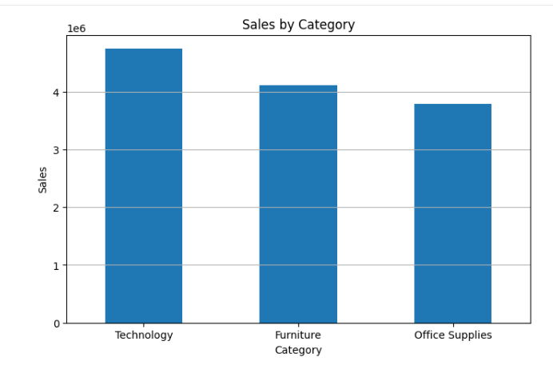
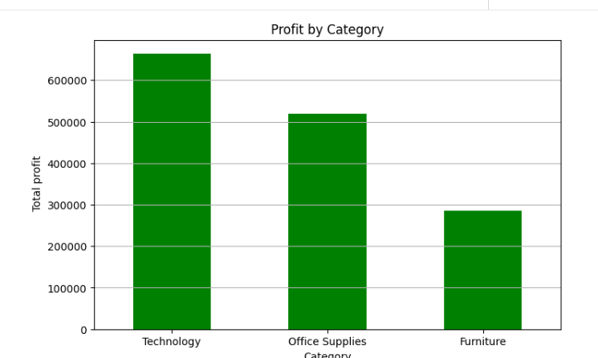
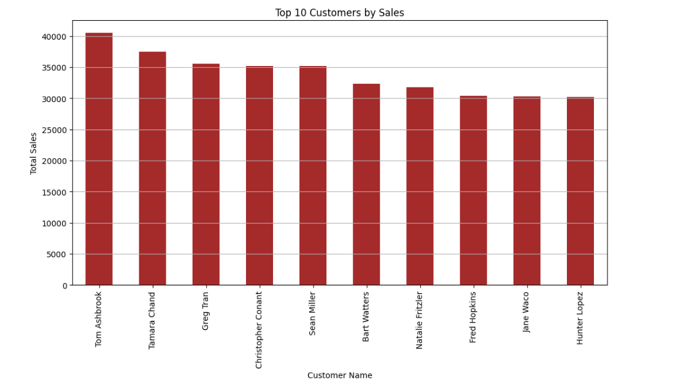
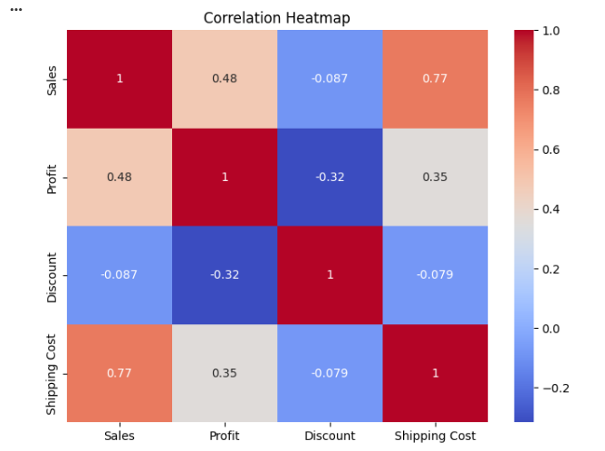
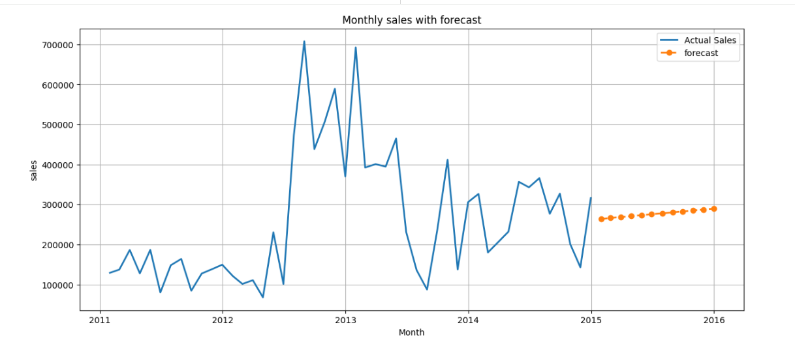

📊 Sales Data Analysis

📌 Project Overview

This project analyzes the Global Superstore dataset to identify important business insights related to sales, profit, customers, products, regions, and shipping performance.

The project includes data cleaning, feature engineering, exploratory data analysis, KPI calculation, data visualization, customer and product analysis, and basic sales forecasting.

🎯 Objectives

- Analyze overall sales and profit performance
- Identify top-performing products and customers
- Compare sales across categories and regions
- Analyze monthly, yearly, and quarterly sales trends
- Study profit margins and discounts
- Analyze delivery time and shipping modes
- Identify profitable and loss-making states and products
- Perform basic sales forecasting

🛠️ Technologies Used

- Python
- Pandas
- NumPy
- Matplotlib
- Seaborn
- Statsmodels
- Google Colab

🔍 Analysis Performed

Data Cleaning
- Checked missing values
- Checked duplicate records
- Converted date columns
- Created new analytical features

### Exploratory Data Analysis
- Sales by Category
- Sales by Sub-Category
- Profit by Category
- Sales by Region
- Sales by Customer Segment
- Top 10 Products by Sales
- Top 10 Customers by Sales
- Sales by State
- Sales by Ship Mode

### 📈 Advanced Analysis
- Monthly Sales Trend
- Monthly Profit Trend
- Year-wise Sales
- Quarter-wise Sales
- Orders by Weekday
- Profit Margin Analysis
- Delivery Time Analysis
- Pareto Analysis
- Discount Analysis
- Sales vs Profit Analysis
- Correlation Heatmap
- Loss-making Products
- Most and Least Profitable States

### 🔮 Forecasting

Basic time-series forecasting was performed using Exponential Smoothing to estimate future monthly sales.

## 📊 Key KPIs

- Total Sales
- Total Profit
- Total Orders
- Total Customers
- Average Order Value

## 📁 Project File

`Sales_Data_Analysis.ipynb` - Complete Python data analysis notebook.

## 📊 Project Visualizations

### Sales by Category

### Profit by Category

### Top 10 Customers

### Correlation Heatmap

### Sales Forecast

## 🚀 Conclusion

This project demonstrates practical skills in data cleaning, exploratory data analysis, visualization, KPI analysis, business problem solving, and basic time-series forecasting using Python.

**Author:** Nisha Tekade
